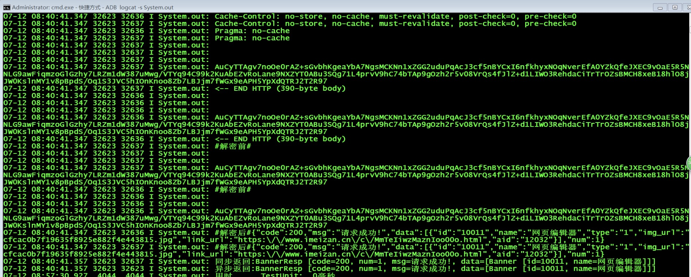

##### [查看请求用例](用例.md)
##### 注册请求体
```
@ReqTags("注册") // 日志过滤,取消请求依据
public class RegisterReq extends CommonRequest {
    public String username;
    public String password;
    public String repassword;

    public RegisterReq(String username, String password, String repassword) {
        this.username = username;
        this.password = password;
        this.repassword = repassword;
    }

    public RegisterReq() {
    }

    @Override
    public String postfix() {
        return "user/register"; // 请求后缀
    }
}
```

##### 发起请求

```
final RegisterReq json = new RegisterReq("12132322333", "123456", "123456");
 HttpRequestFactory.doPost(json, new ResultCallbackAdapt<HttpCommObjResp<RegisterResp>>() {
            @Override
            public void doOnResponse(HttpCommObjResp<RegisterResp> response) {
                System.out.println(response + "");
                mContent.setText("\n方式一返回:" + response);
            }

            @Override
            public void doOnError(ApiException ex) {
                System.out.println(ex + "");
                mContent.setText("\n方式一返回:" + ex);
            }
        }, iLoading);

        // 方式二
        HttpRequestFactory.doPost(json, new ResultCallbackAdapt<String>() {
            @Override
            public void doOnResponse(String response) {
                System.out.println(response + "");
                mContent.setText("\n方式二返回:" + response);
            }

            @Override
            public void doOnError(ApiException ex) {
                System.out.println(ex + "");
                mContent.setText("\n方式二返回:" + ex);
            }
        });
```

初始化函数

```
public class MyApplication extends Application
{
	@Override
    public void onCreate()
    {
        super.onCreate();
         HttpRequestFactory.doCreateHttpReqManager(this, ResLibConfig.DEBUG ? "http://www.wanandroid.com/" : "http://www.wanandroid.com/")
                 .registerCallbacks(new HttpHeadersImpl() {
                     @Override
                     public Map<String, String> generateHeaders() {
                         Map<String, String> keys = new HashMap<>();
                         //        keys.put("versionCode", "" + IUtil.obtainAppVersionCode(ResLibConfig.CONTEXT));
                         //        keys.put("version", IUtil.obtainAppVersion(ResLibConfig.CONTEXT));
                         //        keys.put("channel", "");
                         //        keys.put("imei", "");
                         //        keys.put("platform", "2");//1:ios 2:Android
                         //        keys.put("model", IUtil.MODEL);
                         //        keys.put("vendor", IUtil.BRAND);
                         return keys; // 请求头注入,如有需要
                     }
                 }).registerCallbacks(new HttpInterceptor() {
             @Override
             public void doInterceptor(int... cmds) {
                 if (cmds != null && cmds.length > 0) {
                     int code = cmds[0];
                     switch (code) {
                         case HttpInterceptor.KICKED_OFF_LINE:
                             //Tools.showToast("用户已在其他设备登录");
                             int value = AUTO_INCREMENT.incrementAndGet();
                             if (value == 1) {
                                 // relogin(); // 调用一次
                             }
                             Logger.e("http", "用户已在其他设备登录|" + value + "|");
                             break;
                         case HttpInterceptor.PROHIBIT_USED:
                             //Tools.showToast("您被禁止使用");
                             break;
                         case HttpInterceptor.PROHIBIT_USEDII:
                             //Tools.showToast("用户被封禁,不能登录");
                             break;
                         case HttpInterceptor.UN_LOGIN:
                             //Tools.showToast("请先登录");
                             //relogin(false);
                             break;
                     }
                 }
             }
         }).asEncryptFuncs(new EncryptFuncs() {
             @Override
             public String encrypt(String plainText) {
                 //return AesEncryptionUtil.encrypt(plainText);
                 return "";
             }

             @Override
             public String decrypt(String cipherText) {
                 //return AesEncryptionUtil.decrypt(cipherText);
                 return "";
             }

             /**
              * {@link ReqTags}
              * {@link kaiqi.cn.httpx.req.RegisterReq}
              * 请给予tag,否则取消不掉请求,拦截不了加密解密赛~
              */
             @Override
             public boolean accept(String httpReaTag) {
                 if ("注册".equals(httpReaTag)) {
                     // return false; // 你们都同意,我注册第一个不答应
                 }
                 return true; // 同意加密
             }
         }).asSubmmitForm(true); // true = 表单提交 false = json提交

    }
}

```


##### tips:关于用HttpCommObjResp<RegisterResp> 还是用 HttpCommObjsResp<RegisterResp>

##### 形如格式:
```
{
 "code":200,
 "msg":"成功",
 "data":{}
}
```
##### data = {} 是对象,所以用HttpCommObjResp<RegisterResp>

##### 形如格式:
```
{
 "code":200,
 "msg":"成功",
 "data":[]
}
```
##### data = [] 是数组对象,所以用HttpCommObjsResp<RegisterResp>

##### 我以为所有的接口返回都是这样的,其实并不是
##### 以下是注册返回json

```
{
	"data": {
		"collectIds": [],
		"email": "",
		"icon": "",
		"id": 9073,
		"password": "123456",
		"token": "",
		"type": 0,
		"username": "19910222"
	},
	"errorCode": 0,
	"errorMsg": ""
}
```

##### 为什么不是code,msg??

##### 不过不要怕,照样无缝链接网络调用,提供json,表单两种提交方式|下载,上传这个没上心写!!!

###### 因为暂时支持这几种返回格式的组合,不满足格式的话,如有需要,请修改源码
~~~
{
    "msg":"",
    "code"100,
    "data":{}
}
{
    "errorMsg":"",
    "errorCode"100,
    "data":{}
}
{
    "message":"",
    "error"100,
    "infos":{}
}
{
    ....
    "results":{}
}
~~~

###### 关于取消请求

```
HttpRequestFactory.cancel("注册");//取消单个
HttpRequestFactory.cancel("注册","首页文章列表"); // 取消多个

```

##### 关于加密解密,暂时只支持json加密解密!!!


##### 关于上传,公司项目图片现在都走阿里云,实在是没测试接口了,欢迎大佬们提供测试接口,让我来完善这个库~
##### 代码还有很多不足之处,请指教


[混淆配置](混淆配置.md)

##### 当日志满天飞,你说我有格式化日志工具类,美倒是美,接口多了,不好找啊,
##### 那怎么样才可以找我想要的接口信息呢?
##### 问的好,请看日志截图,一图胜千言~是不是很清爽,看我所看,爱我所爱.


> 为什么要这样写?看下服务端代马

```
	@RequestMapping(value = "/showUser", method = { RequestMethod.GET,
			RequestMethod.POST }, produces = "application/json;charset=UTF-8")
	public JSONObject toIndex(@RequestBody(required = false) String data) {
		return callHttpReqTask(data, TO_INDEX);
	}

	@RequestMapping(value = "/addUser", method = { RequestMethod.GET,
			RequestMethod.POST }, produces = "application/json;charset=UTF-8")
	public JSONObject addUser(@RequestBody(required = false) String data) {
		return callHttpReqTask(data, ADD_USER);
	}
```
##### 每一个请求都有一个RequestMapping
##### 我在每一个请求体上构造一个后缀,岂不是和后台相映成趣.


#####  调用堆栈不深,适合新手阅读源码,有可取之处,给我加star吧

#####  转载注明出处 [HttpX](https://github.com/majunm/HttpX)
##### 如有需要 [加密解密库](https://github.com/majunm/encryptanddecrypt)

[](https://jitpack.io/#majunm/HttpX)


> 使用方式,如有需要
```
allprojects {
		repositories {
			...
			maven { url 'https://jitpack.io' }
		}
	}
```

```
	dependencies {
    	        implementation 'com.github.majunm:HttpX:v1.0.0-gammax'
    	}
```